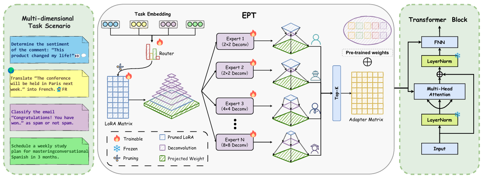

# EPT: Expert Pyramid Tuning

> **Expert Pyramid Tuning: Efficient Parameter Fine-Tuning for Task Allocation Based on Professional Specialization**

[](https://www.python.org/downloads/)
[](https://pytorch.org/)

## 📋 Overview

<p align="center">
  
</p>

## 🔧 Environment Setup

### Prerequisites

- Python 3.10+
- CUDA 11.8+
- NVIDIA GPU (A100 80GB recommended)

### Installation

```bash
# 1. Create conda environment
conda create -n ept python=3.10 -y
conda activate ept

# 2. Install PyTorch (CUDA 11.8)
pip install torch==2.1.0 torchvision==0.16.0 torchaudio==2.1.0 --index-url https://download.pytorch.org/whl/cu118

# 3. Install dependencies
pip install -r requirements.txt
```

### Requirements

```
accelerate>=1.0.0
datasets>=4.0.0
deepspeed>=0.12.0
transformers>=4.36.0
peft>=0.7.0
numpy>=1.24.0
scipy>=1.11.0
scikit-learn>=1.3.0
matplotlib>=3.7.0
tqdm>=4.65.0
pandas>=2.0.0
sentencepiece>=0.1.99
evaluate>=0.4.0
```

## 📁 Project Structure

```
EPT/
├── finetune.py          # Main training script
├── trainer.py           # Custom trainer with task routing
├── metrics.py           # Evaluation metrics (accuracy, F1, etc.)
├── rank.py              # Task ID management
├── requirements.txt     # Python dependencies
├── t5-base/             # Pre-trained T5-base model
├── data/                # Dataset processing utilities
├── peft/                # Modified PEFT library with EPT
├── transformers/        # Modified Transformers library
└── script/
    └── train_ept.sh     # Training script
```

## 📊 Datasets

| Dataset | Source | Task Type |
|---------|--------|-----------|
| **GLUE** | [GLUE Benchmark](https://gluebenchmark.com/tasks) | NLU |
| **BoolQ, CB** | [SuperGLUE Benchmark](https://super.gluebenchmark.com/tasks) | QA / NLI |

## 🚀 Training

### Quick Start

```bash
cd EPT
bash script/train_ept.sh
```

### Training Configuration

| Parameter | Value |
|-----------|-------|
| Expert Kernel Sizes | 2, 2, 4, 4, 6, 6, 8, 8 |
| Top-k Experts | 2 |
| LoRA Rank | 8 |
| LoRA Alpha | 32 |
| Learning Rate | 3e-4 |
| Batch Size | 128 |
| Warmup Steps | 500 |

### Multi-GPU Training

```bash
# Dual GPU training
deepspeed --include localhost:0,1 --master_port 17621 finetune.py \
  --model_name_or_path ./t5-base \
  --expert_kernel_sizes 2 2 4 4 6 6 8 8 \
  --moe_top_k 2 \
  --per_device_train_batch_size 256 \
  ...
```

## 📈 Results

### GLUE Benchmark (T5-base)

| Method | Params/Task | MNLI | QQP | QNLI | SST-2 | STS-B | MRPC | RTE | CoLA | **AVG** |
|--------|:-----------:|:----:|:---:|:----:|:-----:|:-----:|:----:|:---:|:----:|:-------:|
| Fine-tuning | 28M | 85.7 | 91.1 | 92.0 | 92.5 | 88.8 | 90.2 | 75.4 | 54.9 | 83.8 |
| Adapters | 1.8M | 86.3 | 90.5 | 93.2 | 93.0 | 89.9 | 90.2 | 70.3 | 61.5 | 84.4 |
| PT | 9.6K | 85.6 | 90.6 | 93.2 | 93.9 | 89.9 | 86.3 | 67.6 | 55.3 | 82.8 |
| LoRA (r=8) | 0.39M | 85.8 | 89.2 | 93.1 | 93.2 | 90.4 | 89.9 | 76.3 | 62.8 | 85.1 |
| LoRA (r=16) | 0.78M | 84.9 | 89.6 | 93.0 | 93.7 | 90.4 | 88.7 | 80.6 | 63.9 | 85.6 |
| HyperFormer | 638K | 85.7 | 90.0 | 93.0 | 94.0 | 89.7 | 87.2 | 75.4 | 63.7 | 84.8 |
| MPT | 10.5K | 84.3 | 90.0 | 93.0 | 93.3 | 90.4 | 89.2 | 82.7 | 63.5 | 85.8 |
| MultiLoRA | 1.56M | 85.9 | 89.7 | 92.8 | 94.5 | 89.8 | 88.2 | 80.6 | 66.9 | 86.0 |
| MixLoRA | 1.49M | 85.8 | 90.0 | 92.9 | 93.7 | 90.3 | 89.2 | 78.4 | 67.2 | 85.9 |
| MOELoRA | 0.81M | 86.3 | 90.4 | 93.2 | 94.2 | 89.8 | 90.7 | 79.9 | 65.3 | 86.2 |
| MoRE | 0.81M | 85.6 | 90.2 | 93.1 | 93.9 | 89.9 | 90.7 | 77.7 | 68.7 | 86.2 |
| **EPT (Ours)** | **0.81M** | **86.4** | **90.2** | **93.6** | **94.5** | **90.0** | **90.7** | **82.0** | **68.9** | **87.0** |

## 📝 Citation

If you find this work useful, please cite our paper:

```bibtex
@inproceedings{ept2025,
  title={Expert Pyramid Tuning: Efficient Parameter Fine-Tuning for Task Allocation Based on Professional Specialization},
  author={},
  booktitle={},
  year={2025}
}
```

## 🙏 Acknowledgements

This work builds upon the following excellent projects:
- [Hugging Face Transformers](https://github.com/huggingface/transformers)
- [PEFT](https://github.com/huggingface/peft)
- [DeepSpeed](https://github.com/microsoft/DeepSpeed)
